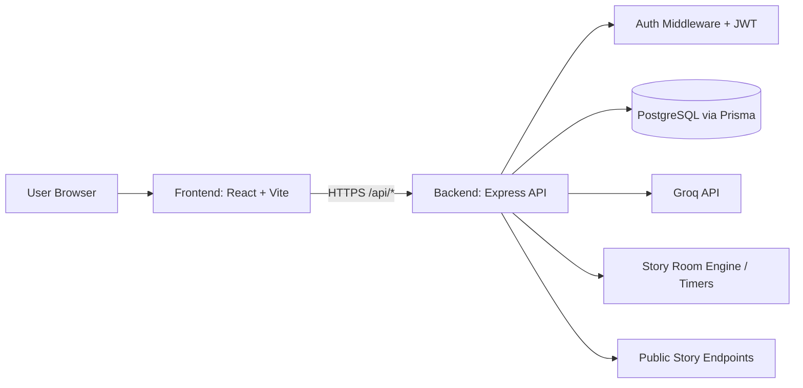

# Ink

A modern writing workspace for individuals and teams.

Ink combines a rich document editor, collaborative story rooms, favorites/trash workflows, theme customization, and AI writing assistance into one focused platform.

## Highlights

- Rich text editor with autosave and formatting tools
- Dashboard with templates, document search, favorites, and trash
- Story Rooms for collaborative writing sessions
- Theme customization (Classic, Midnight, Ocean, Sepia)
- AI writing assistant (ideas, rewrite, continue) powered by Groq
- Public story publishing via shareable slug URLs
- JWT-based authentication with Google Sign-In support

## Feature Matrix

| Module | Capability | Status |
| --- | --- | --- |
| Auth | Email/password login + signup | Implemented |
| Auth | Google Sign-In | Implemented |
| Documents | Create/edit/autosave | Implemented |
| Documents | Favorites workflow | Implemented |
| Documents | Trash + restore + permanent delete | Implemented |
| Editor | Rich formatting toolbar | Implemented |
| Editor | Outline panel | Implemented |
| AI | Writing ideas/rewrite/continue assistant | Implemented |
| Story Rooms | Turn-based collaborative writing | Implemented |
| Themes | Classic/Midnight/Ocean/Sepia | Implemented |

## Project Structure

```text
INK/
├── frontend/   # React + Vite client app
└── backend/    # Express + Prisma API service
```

## Tech Stack

### Frontend

- React 18 + TypeScript
- Vite
- Tailwind CSS + shadcn/ui + Radix UI
- TipTap editor
- TanStack Query
- React Router

### Backend

- Node.js + Express
- Prisma ORM
- PostgreSQL (Neon-compatible)
- JWT authentication
- Google OAuth verification
- Groq API integration for AI assistance

## Core Features

### 1) Authentication & Accounts

- Email/password signup and login
- Google login support
- Protected routes for authenticated pages
- Account info and settings view

### 2) Document Management

- Create, edit, and autosave documents
- Mark/unmark favorites
- Soft-delete to trash
- Restore from trash
- Permanently delete from trash

### 3) Writing Experience

- Rich formatting toolbar (headings, alignment, lists, code, links, callouts, colors, highlights)
- Outline panel in editor
- Contextual AI assistant in dashboard and editor

### 4) Collaboration & Publishing

- Story Room workflow (create, join, play turns, results)
- Public story route by slug (`/story/:slug`)

### 5) UI / Personalization

- Responsive dashboard and editor layout
- Multiple app themes with local persistence

## Architecture Overview

- `frontend` consumes backend REST APIs via `VITE_API_URL`.
- `backend` exposes APIs under `/api/*`.
- Prisma handles database reads/writes.
- Auth middleware protects private endpoints.
- AI endpoint (`/api/ai/assist`) proxies Groq requests securely from backend.

## System Architecture



### Runtime Components

| Layer | Main Components | Responsibility |
| --- | --- | --- |
| Client | React, TipTap, TanStack Query, Router | UI rendering, editor UX, API calls, route guards |
| API | Express routes (`auth`, `docs`, `story-rooms`, `public`, `ai`) | Business logic, validation, response shaping |
| Security | JWT middleware, CORS, Helmet | Authn/authz, origin controls, HTTP hardening |
| Data | Prisma + PostgreSQL | Persistent storage for users/docs/rooms |
| AI Integration | `/api/ai/assist` + Groq | Server-side AI calls without exposing provider key |

## API Modules (Backend)

- `/api/auth` - signup/login/google/refresh/logout
- `/api/me` - current user profile
- `/api/docs` - CRUD, favorites, trash/restore/permanent delete
- `/api/story-rooms` - collaborative room features
- `/api/public` - public story access
- `/api/ai` - AI writing assist

| Route Group | Example Endpoints | Auth Required |
| --- | --- | --- |
| `/api/auth` | `/signup`, `/login`, `/google`, `/refresh`, `/logout` | No (except logout with token) |
| `/api/me` | `GET /api/me` | Yes |
| `/api/docs` | `/`, `/:id`, `/:id/favorite`, `/:id/trash`, `/:id/restore`, `/:id/permanent`, `/favorites`, `/trash` | Yes |
| `/api/story-rooms` | room creation, join/play/submit/vote/publish flows | Yes |
| `/api/public` | `GET /api/public/story/:slug` | No |
| `/api/ai` | `POST /api/ai/assist` | Yes |

## Local Development

## Prerequisites

- Node.js 18+ (Node 20+ recommended)
- npm
- PostgreSQL database (or Neon)

## 1) Clone & install

```bash
git clone <your-repo-url>
cd INK

cd backend && npm install
cd ../frontend && npm install
```

## 2) Configure environment variables

### Backend (`backend/.env`)

You can start from `backend/.env.example` and add the following:

```bash
PORT=4000
NODE_ENV=development
DATABASE_URL="postgresql://<username>:<password>@<host>/<db>?sslmode=require"

JWT_ACCESS_SECRET=<strong-secret>
JWT_REFRESH_SECRET=<strong-secret>
ACCESS_TOKEN_EXP=15m
REFRESH_TOKEN_EXP=30d

GOOGLE_CLIENT_ID=<google-client-id>
FRONTEND_URL=http://localhost:8080,http://localhost:5173
COOKIE_DOMAIN=localhost

GROQ_API_KEY=<groq-api-key>
```

### Frontend (`frontend/.env`)

```bash
VITE_API_URL=http://localhost:4000
VITE_GOOGLE_CLIENT_ID=<google-client-id>
```

### Environment Variables Reference

| Variable | Layer | Required | Purpose |
| --- | --- | --- | --- |
| `PORT` | Backend | Yes | API server port |
| `NODE_ENV` | Backend | Yes | Runtime mode |
| `DATABASE_URL` | Backend | Yes | PostgreSQL connection string |
| `JWT_ACCESS_SECRET` | Backend | Yes | Access token signing secret |
| `JWT_REFRESH_SECRET` | Backend | Yes | Refresh token signing secret |
| `ACCESS_TOKEN_EXP` | Backend | Yes | Access token expiry duration |
| `REFRESH_TOKEN_EXP` | Backend | Yes | Refresh token expiry duration |
| `GOOGLE_CLIENT_ID` | Backend/Frontend | Optional | Google OAuth verification and client login |
| `FRONTEND_URL` | Backend | Yes | Allowed frontend origins for CORS/cookies |
| `COOKIE_DOMAIN` | Backend | Yes | Cookie domain scope |
| `GROQ_API_KEY` | Backend | Optional (required for AI) | AI provider key for writing assistant |
| `VITE_API_URL` | Frontend | Yes | Base URL for backend API |
| `VITE_GOOGLE_CLIENT_ID` | Frontend | Optional | Google OAuth in UI |

## 3) Database setup

```bash
cd backend
npm run prisma:generate
npm run prisma:migrate
```

## 4) Run both services

### Backend

```bash
cd backend
npm run dev
```

### Frontend

```bash
cd frontend
npm run dev
```

Default local URLs:

- Frontend: `http://localhost:8080` (Vite)
- Backend: `http://localhost:4000`

## Scripts

### Frontend (`frontend/package.json`)

- `npm run dev` - start development server
- `npm run build` - production build
- `npm run build:dev` - development-mode build
- `npm run lint` - lint code
- `npm run preview` - preview production build

### Backend (`backend/package.json`)

- `npm run dev` - run with nodemon
- `npm run start` - run with node
- `npm run prisma:generate` - generate Prisma client
- `npm run prisma:migrate` - run migrations

### Script Reference Table

| Command | Location | What it does |
| --- | --- | --- |
| `npm run dev` | `frontend/` | Starts Vite dev server |
| `npm run build` | `frontend/` | Creates production frontend bundle |
| `npm run preview` | `frontend/` | Serves built frontend locally |
| `npm run lint` | `frontend/` | Runs ESLint checks |
| `npm run dev` | `backend/` | Starts API with nodemon |
| `npm run start` | `backend/` | Starts API in standard Node mode |
| `npm run prisma:generate` | `backend/` | Generates Prisma client |
| `npm run prisma:migrate` | `backend/` | Applies Prisma migrations |

## Important Notes

- Keep secrets only in backend env files; never expose API keys in frontend code.
- If you update environment variables while backend is running, restart nodemon.
- The AI assistant requires `GROQ_API_KEY` on the backend.
- CORS is controlled in `backend/server.js` via default + env-provided origins.

## Deployment Checklist

- Set production `DATABASE_URL`
- Set strong JWT secrets
- Configure production `FRONTEND_URL` / allowed origins
- Set `GROQ_API_KEY` on server environment
- Build frontend with correct `VITE_API_URL`
- Run Prisma migration in production environment

## Future Improvements

- Add automated test suites (unit + integration + e2e)
- Add CI for lint/build/test checks
- Add role-based collaboration permissions
- Improve editor collaboration with real-time cursors

---

If you want, I can also create separate polished READMEs inside `frontend/` and `backend/` with module-specific setup and endpoint reference tables.
